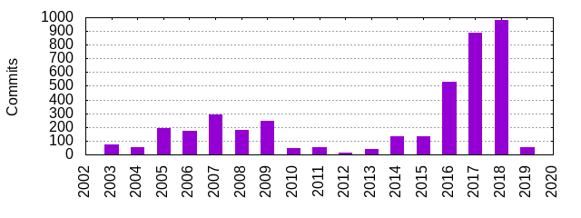
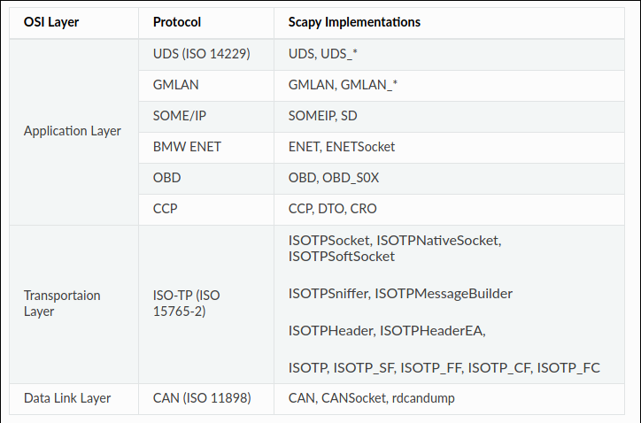
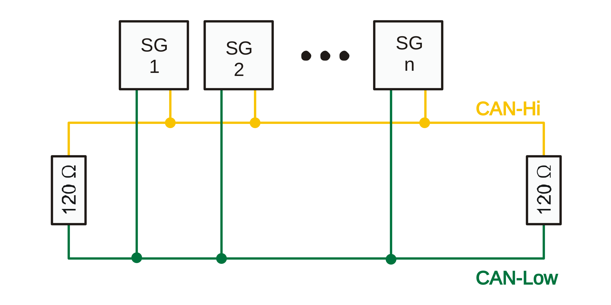

## About us

#### Nils

* PhD Student @ OTH Regensburg

#### Enrico

* PhD Student @ OTH Regensburg


## Acknowledgements

Author of Scapy
```text
Philippe Biondi             - phil@secdev.org
```
Maintainers of Scapy
```text
Guillaume Valadon (@guedou) - guillaume@valadon.net
Gabriel Potter              - gabriel@potter.fr
Pierre Lalet (@pi3rre)      - pierre@droids-corp.org
```

---

## Why Scapy for automotive penetration testing
We've tested a many automotive penetration testing tools. 
<div style="display: inline-block; ">
<div style="text-align: left; float: left;">
<p data-markdown>
- can-utils
- CANiBUS
- CANToolz
- Caring Caribou
- Kayak
</p>
</div><div style="text-align: left; float: right; margin-left: 2em;">
<p data-markdown>
- Metasploit
- UDSIM
- O2OO
- CAN-Badger
- CANtact
</p></div>
</div><br/>


 
#### On of this criterias were always bad: 

- performance 
- maintainability 
- extendability 
- stability
- just one OEM supported
- dead project


#### We also evaluated some CAN-adapters: 

https://cscs.mpi-inf.mpg.de/files/2018/09/05-A-Survey-on-Media-Access-Solutions-for-CAN-Penetration-Testing.pdf


### Advantages of Scapy: 

- Well know penetration test tool
- Active community and maintainers. Not a dead project
- Originated from Ethernet and Internet penetration testing
- Automotive Industry moves towards Ethernet/Internet 
 



### Our Idea: 
Let's add all the properitary automotive protocols to Scapy, 
to get a swiss army knife for automotive network penetration testing.

---

## Overview



---

## CAN

- Developed in 1983 from Bosch
- Data-Frames
	- Identifier (11 or 29 Bits)
	- Control Field (Extended Identifier, Remote Frame, Error Frame)
	- Length Field
	- Data Field
- Arbitration by Identifier
- Bit-Stuffing
- CRC included
- ISO 11898


### can-utils - SocketCAN userspace utilities and tools

Many command line utilities for Linux: https://github.com/linux-can/can-utils

Very helpful for quick tests.


### can-utils

<video class="stretch" controls><source data-src="animations/animation-cansend.webm" type="video/webm"></video>


### python-can

https://github.com/hardbyte/python-can

Cross-Platform: Windows, Linux, OSX

Supports many professional CAN-Interfaces:
- Vector
- NEOVI
- PCAN
- IXXAT
- Kvaser


### CAN in Scapy

```python
class CAN(Packet):
    fields_desc = [
        FlagsField('flags', 0, 3, ['error',
                                   'remote_transmission_request',
                                   'extended']),
        XBitField('identifier', 0, 29),
        FieldLenField('length', None, length_of='data', fmt='B'),
        ThreeBytesField('reserved', 0),
        StrLenField('data', '', length_from=lambda pkt: pkt.length),
    ]
```


### CAN in Scapy

Caution: Linux SocketCAN has a different byte order than tcpdump/libpcap for the first 32 bits

If you have problems with CAN-Frames in Wireshark and Scapy, consider the configuration
```python
conf.contribs['CAN'] = {'swap-bytes': False/True}
```


### Building a CAN frame

```python
>>> load_layer("can")
>>> pkt = CAN(identifier=0x123, data=b'\xde\xad\xbe\xef')
>>> pkt.show2()
###[ CAN ]###
  flags=
  identifier= 0x123
  length= 4
  reserved= 0
  data= '\xde\xad\xbe\xef'

>>> CAN(identifier=0x12312345, flags="extended", data=b'\xde\xad\xbe\xef')
<CAN  flags=extended identifier=0x12312345 data='\xde\xad\xbe\xef' |>
```


### Building a CAN frame

<video class="stretch" controls><source data-src="animations/animation-scapy-canframe.webm" type="video/webm"></video>

---

### CANSockets

Scapy has two types of CANSockets: 
- Native CANSockets
	- require Python3
	- require Linux

- python-can CANSockets
	- require python-can
	- just a wrapper of python-can
	- run on Windows, OSX and Linux

```python
conf.contribs['CANSocket'] = {'use-python-can': True/False}
```


### Native CANSockets
<video class="stretch" controls><source data-src="animations/animation-scapy-native-cansocket.webm" type="video/webm"></video>


### python-can CANSockets
<video class="stretch" controls><source data-src="animations/animation-scapy-python-can-cansocket.webm" type="video/webm"></video>


### CANSockets useful functions

```python
sock.sr(pkt, timeout=1, count=5)
```
```python
sock.sr1(pkt, timeout=1)
```
```python
sock.sniff(timeout=10, count=100)
```
```python
bridge_and_sniff(sock1, sock2, xfrm12, xfrm21, timeout=1)
```


### CANSockets sniff
<video class="stretch" controls><source data-src="animations/animation-scapy-cansockets-sniff.webm" type="video/webm"></video>


### CANSockets MITM

- to observe the communication of one ECU
- split CAN-Bus
- attach one interface to the vehicle CAN-Bus
- attach another interface to the ECU CAN-Bus
- forward CAN-Frames with Scapy


### CANSockets MITM




### CANSockets MITM filter
<video class="stretch" controls><source data-src="animations/animation-scapy-cansockets-mitm.webm" type="video/webm"></video>


### CANSockets MITM manipulation
<video class="stretch" controls><source data-src="animations/animation-scapy-cansockets-mitm2.webm" type="video/webm"></video>


### rdcandump
<video class="stretch" controls><source data-src="animations/animation-scapy-rdcandump.webm" type="video/webm"></video>


### rdpcap
<video class="stretch" controls><source data-src="animations/animation-scapy-rdpcap.webm" type="video/webm"></video>
 
---

## ISOTP

- ISOTP messages are fragmented into CAN frames
- Messages have source and destination identifiers
- Up to 4095 bytes per message
- 4 frame types:
    - Single Frame
    - First Frame
    - Consecutive Frame
    - Flow Control
- Extended addressing


<div>
    <h2>ISOTP Flow</h2>
    
    <dl>
        <dt>Single frame</dt>
        <dd>
            <span class="isotp-bytes">
                05
            </span>
            <span class="data-bytes">
                48 65 6C 6C 6F
            </span>
        </dd>
        <dt>First frame</dt>
        <dd>
            <span class="isotp-bytes">
                10 18
            </span>
            <span class="data-bytes">
                DE AD BE EF AB CD
            </span>
        </dd>
        <dt>Flow control</dt>
        <dd>
            <span class="isotp-bytes">
                30 00 00
            </span>
        </dd>
        <dt>Consecutive Frame</dt>
        <dd>
        <span class="isotp-bytes">21 </span>
        <span class="data-bytes">EF 00 11 22 33 44 55</span>
        </dd>
        <dd>
        <span class="isotp-bytes">22 </span>
        <span class="data-bytes">66 77 88 99 AA BB CC</span>
        </dd>
        <dd>
        <span class="isotp-bytes">23 </span>
        <span class="data-bytes">DD EE FF AA</span>
        </dd>
    </dl>
</div>


### ISOTP Tools
- isotpsend

```plain
$ echo "48 65 6c 6c 6f" | isotpsend -s123 -d321 vcan0
```

- isotprecv

```plain
$ isotprecv -s321 -d123 -l vcan0
48 65 6C 6C 6F
```

- isotpdump

```plain
$ isotpdump -s321 -d123 vcan0 
 vcan0  123  [6]  [SF] ln: 5    data: 48 65 6C 6C 6F 
 vcan0  123  [8]  [FF] ln: 16   data: 00 11 22 33 44 55 
 vcan0  321  [3]  [FC] FC: 0 = CTS # BS: 0 # STmin: 0x00
 vcan0  123  [8]  [CF] sn: 1    data: 66 77 88 99 AA BB CC 
 vcan0  123  [4]  [CF] sn: 2    data: DD EE FF 
```


### ISOTP in Scapy

```python
>>> load_contrib("isotp")
>>> ISOTP(data=b"Hello, this is ISOTP", src=0x123, dst=0x321)
<ISOTP  data='Hello, this is ISOTP' |>
```
```python
>>> _.fragment()
[<CAN  identifier=0x321 data=b'\x10\x14Hello,' |>,
 <CAN  identifier=0x321 data=b'! this i' |>,
 <CAN  identifier=0x321 data=b'"s ISOTP' |>]
```
```python
>>> load_layer("can")
>>> ISOTP.defragment([ CAN(data=b"\x10\x0cthis i"), 
...:                   CAN(data=b"\x21s data!") ])  
<ISOTP  data='this is data' |>
```


#### ISOTPNativeSocket
- Uses the `can-isotp` kernel module from hartkopp
- Only works on linux
- Highly reliable and performant


#### ISOTPNativeSocket: usage

```python
>>> conf.contribs['ISOTP'] = {
...: 'use-can-isotp-kernel-module': True }
>>> load_contrib("isotp")
>>> isotps = ISOTPSocket("vcan0", sid=0x123, did=0x321)
```
```python
>>> isotps.send(ISOTP(data=b"Hello"))
```
```python
>>> isotps.recv()
<ISOTP  data='Hi' |>
```
```python
>>> isotps.sniff(timeout=1)
<Sniffed: TCP:0 UDP:0 ICMP:0 Other:2>
```


#### ISOTPSoftSocket

- Written in python over the CANSocket Scapy object
- Works on all operating systems supported by Scapy


#### ISOTPSoftSocket: usage

```python
>>> conf.contribs['ISOTP'] = {
...: 'use-can-isotp-kernel-module': False }
>>> load_contrib("cansocket")
>>> load_contrib("isotp")
>>> cans = CANSocket("vcan0")
>>> isotps = ISOTPSocket(cans, sid=0x123, did=0x321)
```
```python
>>> isotps.send(ISOTP(data=b"Hello"))
```
```python
>>> isotps.recv()
<ISOTP  data='Hi' |>
```
```python
>>> isotps.close()  # Either close the socket
>>> isotps = None   # or let the GC do it
```


#### ISOTPMessageBuilder

```python
>>> load_contrib("isotp")
>>> load_layer("can")
>>> mb = ISOTPMessageBuilder(use_ext_addr=False)
>>> mb.feed(CAN(identifier=0x321, data=b"\x10\x16This i"))
>>> mb.feed(CAN(identifier=0x321, data=b"\x21s a lon"))
>>> mb.feed(CAN(identifier=0x321, data=b"\x22g messa"))
>>> mb.feed(CAN(identifier=0x321, data=b"\x23ge     "))
>>> mb.pop()
<ISOTP  data='This is a long message' |>
```
```python
>>> mb = ISOTPMessageBuilder(use_ext_addr=True)
>>> mb.feed(CAN(identifier=0x321, data=b"\xEA\x03Hi!!"))
>>> mb.pop()
<ISOTP  data='Hi!' |>
```


### ISOTP sniff
	
<video class="stretch" controls><source data-src="animations/animation-isotp-sniff.webm" type="video/webm"></video>


### ISOTP MITM

<video class="stretch" controls><source data-src="animations/animation-isotp-mitm.webm" type="video/webm"></video>

---

## UDS
<pre style="float: right; width: 30%">
UDS
├── RC
│   ├── ID100
│   ├── ID123
│   └── ID300
├── RDBI
│   ├── ID1
│   ├── ID2
│   └── ID3
└── WDBI
    ├── ID1
    └── ID3
</pre>
<ul style="float: left; width: 60%">
<li>Application layer protocol
<li>Specified in ISO 14229
<li>OEMs extend UDS with properitary substructures
<li>Broadcasts are implemented through special ISOTP endpoints (OEM specific)
<li>Tree-like message structure
</ul>


### UDS Services

- First byte in a UDS frame is called service
- Usually UDS uses a request/response mechanism

Request Services
```
0x00 - 0x3d and 0x80 - 0xbf
```
Positive Response Services
```
0x40 - 0x7d and 0xc0 - 0xff

RequestService | 0x40 == PositiveResponseService
```
Negative Response Service
```
0x7f
```


### UDS Service Examples

```python
UDS.services = {
 16: 'DiagnosticSessionControl',
 17: 'ECUReset',
 34: 'ReadDataByIdentifier',
 35: 'ReadMemoryByAddress',
 39: 'SecurityAccess',
 40: 'CommunicationControl',
 46: 'WriteDataByIdentifier',
 52: 'RequestDownload',
 54: 'TransferData',
 55: 'RequestTransferExit',
 61: 'WriteMemoryByAddress',
 62: 'TesterPresent',
 127: 'NegativeResponse'}
```
List is not complete


### UDS request Scapy packets
```
UDS        : UDS
UDS_ATP    : AccessTimingParameter
UDS_CC     : CommunicationControl
UDS_CDTCI  : ClearDiagnosticInformation
UDS_CDTCS  : ControlDTCSetting
UDS_DDDI   : DynamicallyDefineDataIdentifier
UDS_DSC    : DiagnosticSessionControl
UDS_ER     : ECUReset
UDS_ERPR   : ECUResetPositiveResponse
UDS_IOCBI  : InputOutputControlByIdentifier
UDS_LC     : LinkControl
UDS_NRC    : NegativeResponseCode
UDS_RC     : RoutineControl
UDS_RD     : RequestDownload
UDS_RDBI   : ReadDataByIdentifier
UDS_RDBPI  : ReadDataByPeriodicIdentifier
UDS_RDTCI  : ReadDTCInformation
UDS_RMBA   : ReadMemoryByAddress
UDS_ROE    : ResponseOnEvent
UDS_RSDBI  : ReadScalingDataByIdentifier
UDS_RTE    : RequestTransferExit
UDS_RU     : RequestUpload
UDS_SA     : SecurityAccess
UDS_SDT    : SecuredDataTransmission
UDS_TD     : TransferData
UDS_TP     : TesterPresent
UDS_WDBI   : WriteDataByIdentifier
UDS_WMBA   : WriteMemoryByAddress
```


### Crafting UDS requests

Tester Present Request
```python
req = UDS()/UDS_TP()
```

ReadDataByIdentifier Request
```python
req = UDS()/UDS_RDBI(identifiers=[0x1337])
```

WriteDataByIdentifier Request
```python
req = UDS()/UDS_WDBI(dataIdentifier=0x1337)/Raw(b'someData')
```

RoutineControl Request
```python
req = UDS()/UDS_RC(routineControlType="startRoutine", 
                   routineIdentifier=0x1337, 
                   routineControlOptionRecord=b'someData')
```


### Basic UDS requests
<video class="stretch" controls><source data-src="animations/animation-scapy-uds.webm" type="video/webm"></video>


### UDS sessions and security access
<video class="stretch" controls><source data-src="animations/animation-scapy-uds2.webm" type="video/webm"></video>


### UDS customization
<video class="stretch" controls><source data-src="animations/animation-scapy-uds3.webm" type="video/webm"></video>

---

## GMLAN

Pretty much the same as UDS

Differences:
- Unacknowledged Unsegmented Data Transfer (UUDT)
- Broadcast-mechanism is part of GMLAN
- GMLAN endpoint is a combination of CANSocket and ISOTPSocket


### GMLAN adressing

| Description       | Addressing  |
| --------------    | ----------- |
| USDT Request-IDs  | 0x241-0x25F |
| UUDT Response-IDs | 0x541-0x55F |
| USDT Response-IDs | 0x641-0x65F |
| OBD/EOBD          | 0x7DF-0x7EF |

```python
usdt_sock = ISOTPSocket("vcan0", did=0x641, 
                        sid=0x241, basecls=GMLAN)
uudt_sock = CANSocket("vcan0", 
                      can_filters=[{'can_id': 0x541, 
                                    'can_mask': 0x7ff}])
broadcast_sock = ISOTPSocket("vcan0", sid=0, did=0x101, 
                             basecls=GMLAN, extended_addr=0xfe)

```


### GMLAN UUDT

An UUDT-Service will send the response data on a UUDT Response-ID as CAN-frame.  
GMLAN has two UUDT services:  
- ReadDiagnosticInformation (0xA9)
- ReadDataByPacketIdentifier (0xAA)


### GMLAN UUDT Example

<video class="stretch" controls><source data-src="animations/animation-scapy-gmlan.webm" type="video/webm"></video>

---

## OBD2

- On-Board-Diagnostic Protocol 
- "Read-Only" protocol
- We only focus on CAN. K-Line, PWM and VPWM are not supported in Scapy.
- Request/response mechanism
- Supported flags
- `Request Service | 0x40 == Response Service`


## OBD2 Implementations

| Protocol     | Description          |
| ------------ | -------------------- |
| SAE J1850    | PWM (41.6 kbaud)     |
| SAE J1850    | VPWM (10.4 kbaud)    |
| ISO 9141-2   | K-Line (10.4 kbaud)  |
| ISO 14230-4  | KWP (10.4 kbaud)     |
| ISO 15765-4  | CAN (500 kbaud)      | 
| SAE J1939    | CAN (250 kbaud)      |


### OBD2 Structure

```
OBD
├── Service01
│   └──────── PID (Parameter Identifier)
├── Service02
│   └──────── PID
├── Service03
│   └──────── DTC (Diagnostic Trouble Code)
├── Service04
├── Service06
│   └──────── MID (Monitoring Identifier)
├── Service07
│   └──────── DTC
├── Service08
│   └──────── TID (Test Identifier)
├── Service09
│   └──────── IID (Information Identifier)
└── Service0A
    └──────── DTC
```


### OBD2 supported flags

Any OBD message with an identifier of a multiple of 0x20 returns a supported identifiers flag field.  

```python
>>> OBD()/OBD_S09(iid=0)
<OBD  service=VehicleInformationRequest |<OBD_S09  iid=0x0 |>>
>>> OBD(b'\x49\x00ABCD').show()                                                              
###[ On-board diagnostics ]### 
  service= VehicleInformationResponse
###[ S9_VehicleInformationPositiveResponse ]### 
     iid= 0x0
###[ IID_00_Service9SupportedInformationTypes ]### 
        supported_iids= IID1E+IID1A+IID18+IID17+IID12+IID0F+IID0A+IID08+IID02
```


### OBD2 examples

<video class="stretch" controls><source data-src="animations/animation-scapy-obd.webm" type="video/webm"></video>

---

## ENET

- BMW properitary protocol
- Build on top of TCP
- Used for communication with BMW repair shop testers
- Available on the OBD-Port
- Communication with ECUs and Flashing


## ENETSocket

- Just a specialisation of a StreamSocket

```
sock = ENETSocket('169.254.25.116')
```


## ENET Packet

- Can be used to send UDS commands to any ECU in the car
- `src` and `dst` field for addressing 
- `src=0xf4` means repair shop tester usually
- `dst` depends on the car model

```
>>> pkt = ENET(src=0xf4, dst=0x10)/UDS()/UDS_WDBI(dataIdentifier=0x1337)/Raw(load=b'\xca\xfe\xba\xbe')
>>> pkt.show2()                                                                              
###[ ENET ]### 
  length= 9
  type= message
  src= 0xf4
  dst= 0x10
###[ UDS ]### 
     service= WriteDataByIdentifier
###[ WriteDataByIdentifier ]### 
        dataIdentifier= 0x1337
###[ Raw ]### 
           load= '\xca\xfe\xba\xbe'

```

---

## SOME/IP

Scalable service-Oriented MiddlewarE over IP

- Wide range of middleware features:
    - Remote Procedure Call
    - Service Discovery
    - Publish/Subscribe
- Designed as a replacement for MOST and CAN


#### SOME/IP: usage in scapy

```python
>>> load_contrib("automotive.someip")
```
```python
>>> sip = SOMEIP()
>>> sip.iface_ver = 0
>>> sip.proto_ver = 1
>>> sip.msg_type = "REQUEST"
>>> sip.retcode = "E_OK"
>>> sip.msg_id.srv_id = 0x1234
>>> sip.msg_id.method_id = 0x421
>>> sip.add_payload(Raw ("Hello"))
```
```python
>>> p = IP(src="192.168.0.13", dst="192.168.0.10")
>>> p /= UDP(sport=30509, dport=30509)
>>> p /= sip
>>> send(p)
```


#### SOME/IP: sniffing

```python
>>> load_contrib("automotive.someip")
>>> pkts = sniff(iface="enp0s31f6", timeout=1, 
...:             filter="udp port 30490")
>>> pkts[0]
```

<!--
<div data-markdown><script type="text/template">
```
<Ether  dst=01:00:5e:60:e0:f5 src=b8:27:eb:fd:42:d7 type=IPv4
|<IP  version=4 ihl=5 tos=0x0 len=100 id=41508 flags=DF frag=0 ttl=1 proto=udp chksum=0x54dc src=192.168.0.10 dst=224.224.224.245
|<UDP  sport=30490 dport=30490 len=80 chksum=0x242
|<SOMEIP  msg_id=<_SOMEIP_MessageId  srv_id=65535 sub_id=EVENT_ID event_id=256 |> len=64 req_id=<_SOMEIP_RequestId  client_id=0 session_id=41200 |> proto_ver=1 iface_ver=1 msg_type=NOTIFICATION retcode=E_OK
|<Raw  load='\xc0\x00\x00\x00\x00\x00\x00 \x01\x00\x00\x10\x00\x03\x00 \x00\x00\x00\x03\x00\x00\x00\x00\x01\x00\x00\x10\x124Vx\x00\x00\x00\x03\x00\x00\x00\x00\x00\x00\x00\x0c\x00\t\x04\x00\xc0\xa8\x00\n\x00\x11w-' |>>>>>
```
</script></div>
-->

<pre>
<span class="bg-r">&lt;Ether &nbsp;dst=01:00:5e:60:e0:f5 src=b8:27:eb:fd:42:d7 type=IPv4 |</span><span class="bg-y">&lt;IP &nbsp;version=</span>
<span class="bg-y">4 ihl=5 tos=0x0 len=100 id=41508 flags=DF frag=0 ttl=1 proto=udp chksum=0x54</span>
<span class="bg-y">dc src=192.168.0.10 dst=224.224.224.245 |</span><span class="bg-b">&lt;UDP &nbsp;sport=30490 dport=30490 len=8</span>
<span class="bg-g">0 chksum=0x242 |</span><span class="bg-b">&lt;SOMEIP &nbsp;msg_id=&lt;_SOMEIP_MessageId &nbsp;srv_id=65535 sub_id=EVEN</span>
<span class="bg-b">T_ID event_id=256 |&gt; len=64 req_id=&lt;_SOMEIP_RequestId &nbsp;client_id=0 session_i</span>
<span class="bg-b">d=41200 |&gt; proto_ver=1 iface_ver=1 msg_type=NOTIFICATION retcode=E_OK |</span><span class="bg-p">&lt;Raw </span>
<span class="bg-p">&nbsp;load=&#39;\xc0\x00\x00\x00\x00\x00\x00 \x01\x00\x00\x10\x00\x03\x00 \x00\x00\x0</span>
<span class="bg-p">0\x03\x00\x00\x00\x00\x01\x00\x00\x10\x124Vx\x00\x00\x00\x03\x00\x00\x00\x00</span>
<span class="bg-p">\x00\x00\x00\x0c\x00\t\x04\x00\xc0\xa8\x00\n\x00\x11w-&#39; |&gt;</span><span class="bg-b">&gt;</span><span class="bg-g">&gt;</span><span class="bg-y">&gt;</span><span class="bg-r">&gt;</span>
</pre>


#### SOME/IP Service Discovery

```python
>>> load_contrib("automotive.someip_sd")
```
```python
>>> ea = SDEntry_Service(type = 0x01, srv_id = 0x1234, inst_id = 0x5678,
...:                     major_ver = 0x00, ttl = 3)
>>> oa = SDOption_IP4_EndPoint(addr = "192.168.0.13", l4_proto = 0x11,
...:                           port = 30509)
>>> sd = SD()
>>> sd.set_entryArray(ea)
>>> sd.set_optionArray(oa)
>>> spsd = sd.get_someip(True)
```
```python
>>> p = IP(src="192.168.0.13", dst="224.224.224.245")
>>> p /= UDP(sport=30490, dport=30490)
>>> p /= spsd
>>> send(p)
```

---

### Roadmap: Protocols and Utilities
<div style="display: inline-block; ">
<div style="text-align: left; float: left;">
<p data-markdown>
- AUTOSAR DoIP
- J1939
- XCP
- OEM specific additions
</p>
</div><div style="text-align: left; float: right; margin-left: 2em;">
<p data-markdown>
- Smart fuzzing
- DBC parser
- ODX parser
- ECU simulation 
</p></div>
</div><br/>
<strong>Contribution welcome!!</strong>


## THANKS!

## Questions?
    
